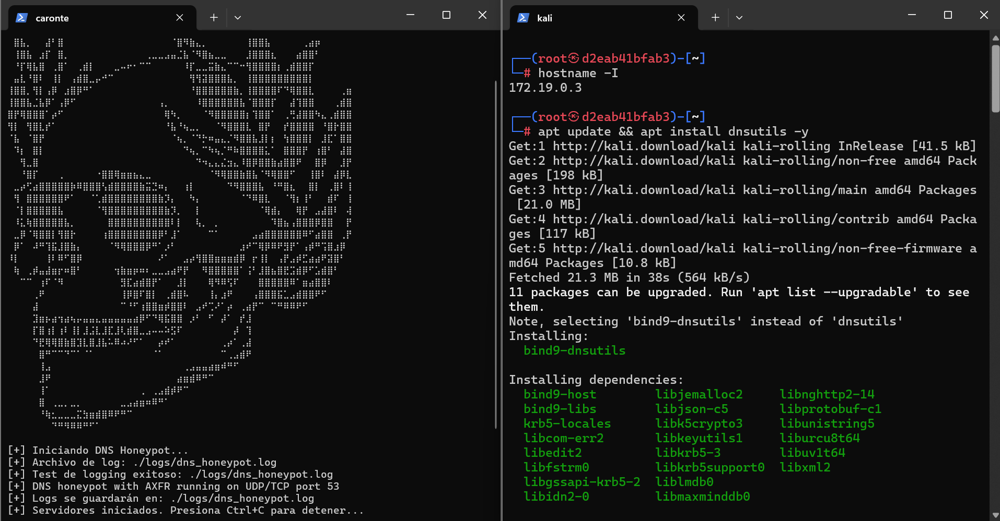
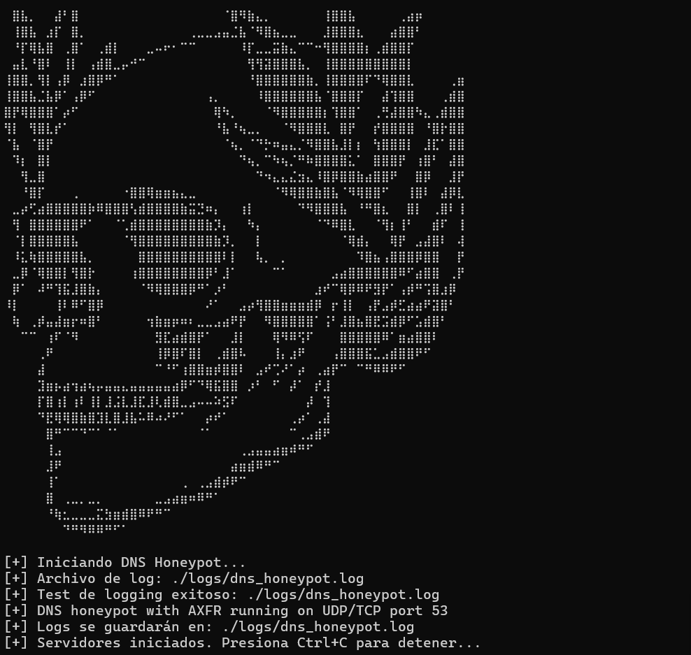
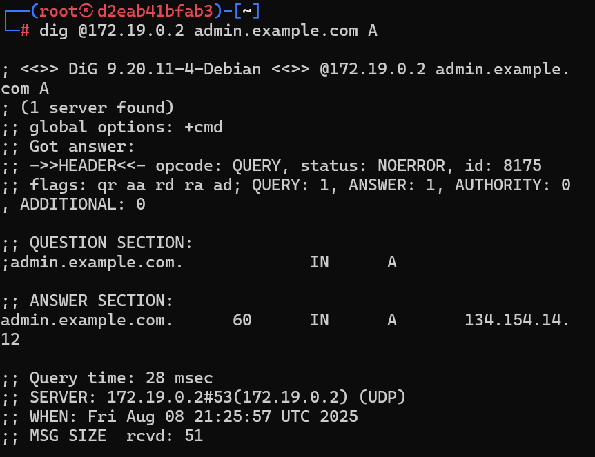
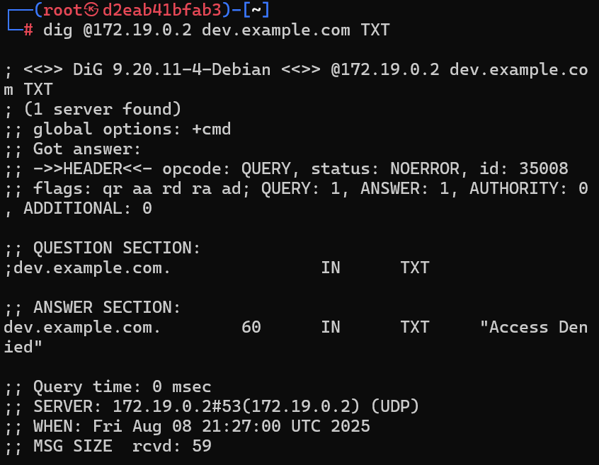
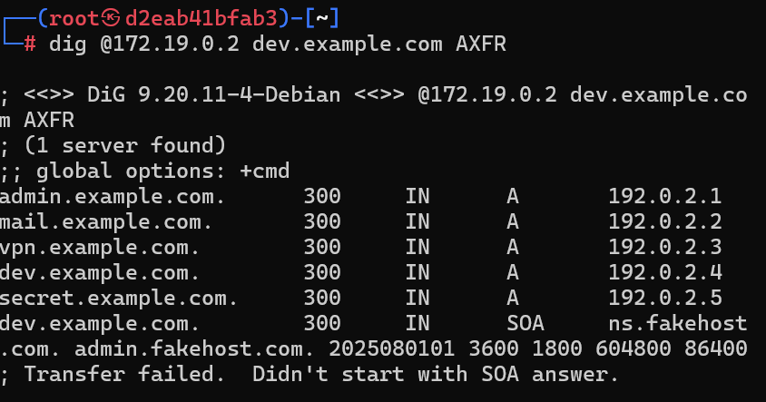
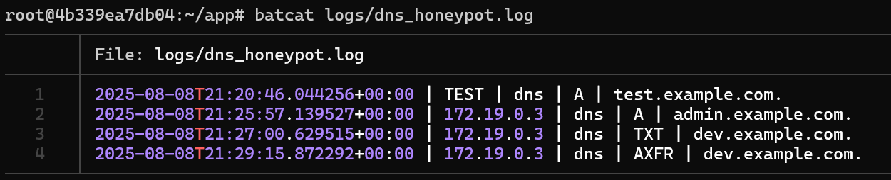

# Caronte

### Caronte es un honeypot tematico inspirado en el barquero del inframundo. Simula servicios DNS para atraer, registrar y analizar el comportamiento de agentes maliciosos. Al igual que su contraparte mitologica, Caronte guia a los intrusos a traves de un dominio ilusorio, mientras sus acciones quedan atrapadas y analizadas en las profundidades.

## Características:
-   ### DNS Honeypot con soporte para UDP/TCP
-   ### Simulación de respuestas tipo A, TXT y AXFR
-   ### Registro detallado de consultas y direcciones IP
-   ### Manejo robusto de logs y errores

## Instalacion
### La instalacion puede ser local o desde docker, ambos medios son efectivos y son faciles de desplegar.
### Local:
    #instalacion de recursos
    apt update && apt install -y git python3 pip3
    #instalacion de dependencias
    pip install dnslib
    #clonar repositorio y desplegar herramienta
    git clone https://github.com/0d1n-oss/caronte.git && cd caronte/
    python3 main.py
### Docker:
    #Instalar docker
    apt update && apt install -y git docker
    #Clonar repositorio
    git clone https://github.com/0d1n-oss/caronte.git && cd caronte/
    #creacion de la imagen:
    docker build -t caronte:latest .

## Pruebas
### El entorno de pruebas se creo desde docker desplegando dos contenedores, el host (caronte) y el atacante (kali).
    #despliegue de el contenedor
    docker run -d --name caronte -v ./caronte:/app/logs caronte:latest

### Al desplegar a caronte este hace varias comprobaciones, mostrando mensajes que muestran los procesos que esta ejecutando el programa.

### Entre las pruebas se realizaron varias peticiones desde el contenedor atacante.
### Primera prueba usando una consulta tipo A.

### Segunda prueba usando una consulta tipo TXT.

### Tercera consulta usando una consulta tipo AXFR.

### Usando la herramienta bat (por comodidad y estilo) se visualizaron los logs de la herramienta.
### Pudiendo ver informacion de las peticiones hechas hacia el honeypot.
    #filtrar solo por el nombre que se busca, en este caso A
    grep -E '\sA\s' dns_honeypot.log | batcat

### Creditos
Copyright © 2021 by [Termux Hackers ID](https://github.com/termuxhackers-id)
